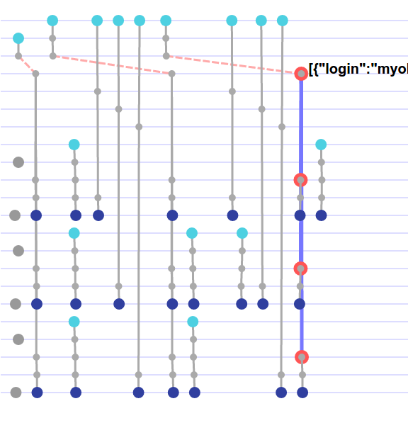

# Take off the blindfold
It's easier to understand what's happening if you can look at it.

`rxvision` is a tool to visualize and debug your RxJS reactive streams.

[](https://jaredly.github.io/rxvision)

# The Demo [(see it live)](https://jaredly.github.io/rxvision)

You'll need `browserify`.

```
npm install
make
```
then open `index.html` in a browser.

# Usage (so far)
I make no promises, this is very WIP.

- Add `sneak.js` to your page, after `rx.all.js` but before your code.
- run your page, do some things to trigger streams
- run `RxVision.dump()` from the console. Replace `data.json` with the output.
- run `make` again.

That ought to work, but no promises yet. Fire up an issue if it doesn't.


